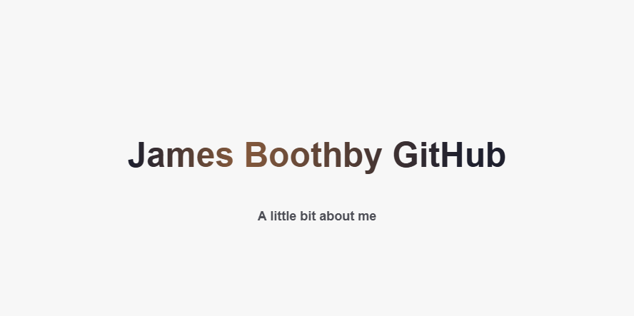
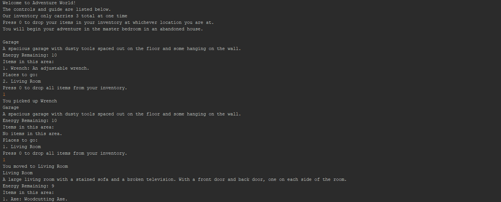
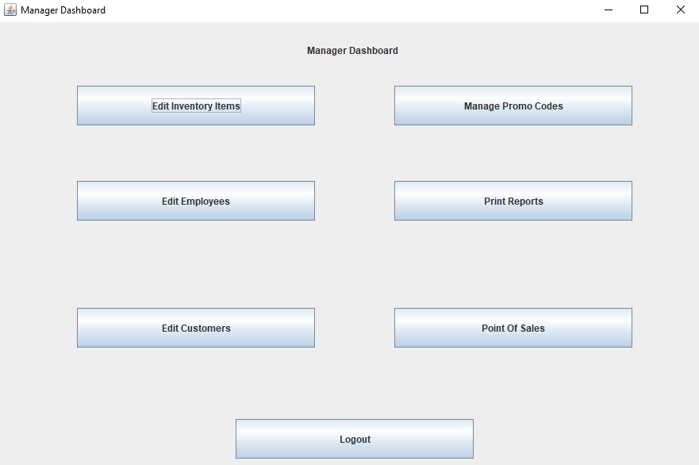
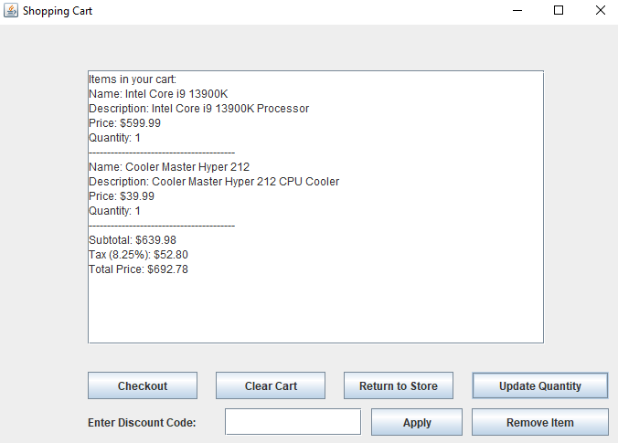
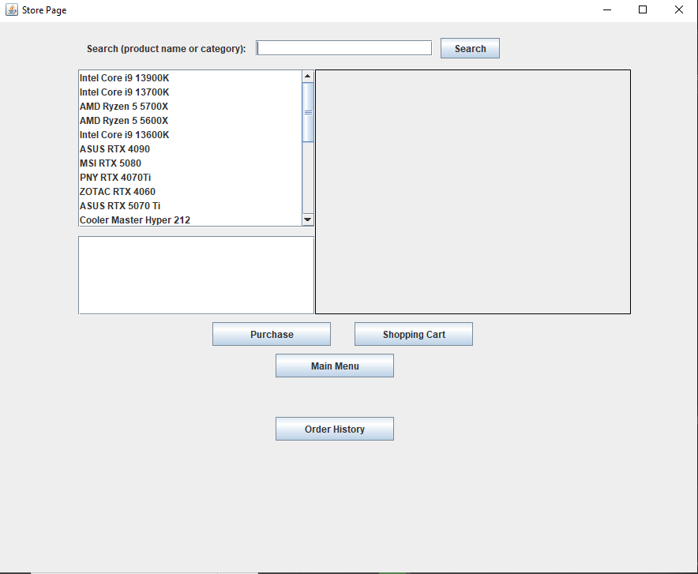
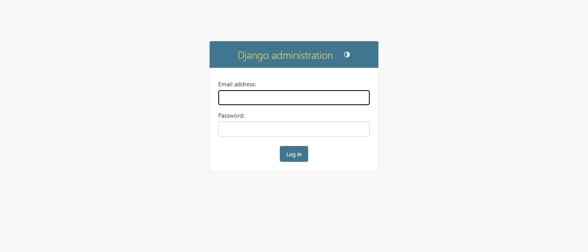
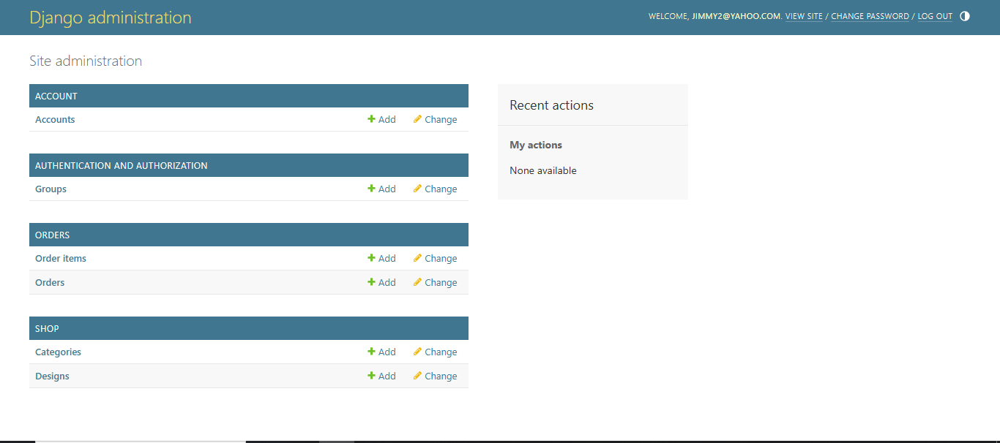

### Hi there 👋, my name is James  
#### I am a student at TSTC

I am in my final semester of college, working toward an Associate's Degree in Computer Programming.  

---

### 🧠 Skills  
**Languages/Technologies:**  

---

### 🚀 Current Focus  
- 🔭 I’m currently working on this GitHub page  
- 🌱 Learning threading and object-oriented programming (OOP)  
- 💬 Ask me about my coding journey  
- 📫 Reach me at: [jiboothby@mymail.tstc.edu](mailto:jiboothby@mymail.tstc.edu)  

---

### 🖼️ Project Previews
Here are some previews of the projects I've been working on:

🎮 Java Text Adventure Game
A small Java-based console game where you explore rooms, collect items, and bring them all to a final room — but with limited moves!

🧩 Gameplay Highlights:

Move between connected rooms (e.g., kitchen, garage, living room)

Pick up scattered items (e.g., wrench, hammer)

Drop items in a designated collection room

Win by collecting all items before you run out of moves

🧾 Java Swing POS & Inventory System
Desktop-based point-of-sale with inventory and order management

Main dashboard of the POS system

View of the shopping cart with items from the store page

View of the storepage

🧠 Employee Management System
Java + SQLite app for managing employees and roles

Search and edit employee records

🌐 Django Web App
Python Django-based web platform with authentication and report generation

Login and dashboard interface 

